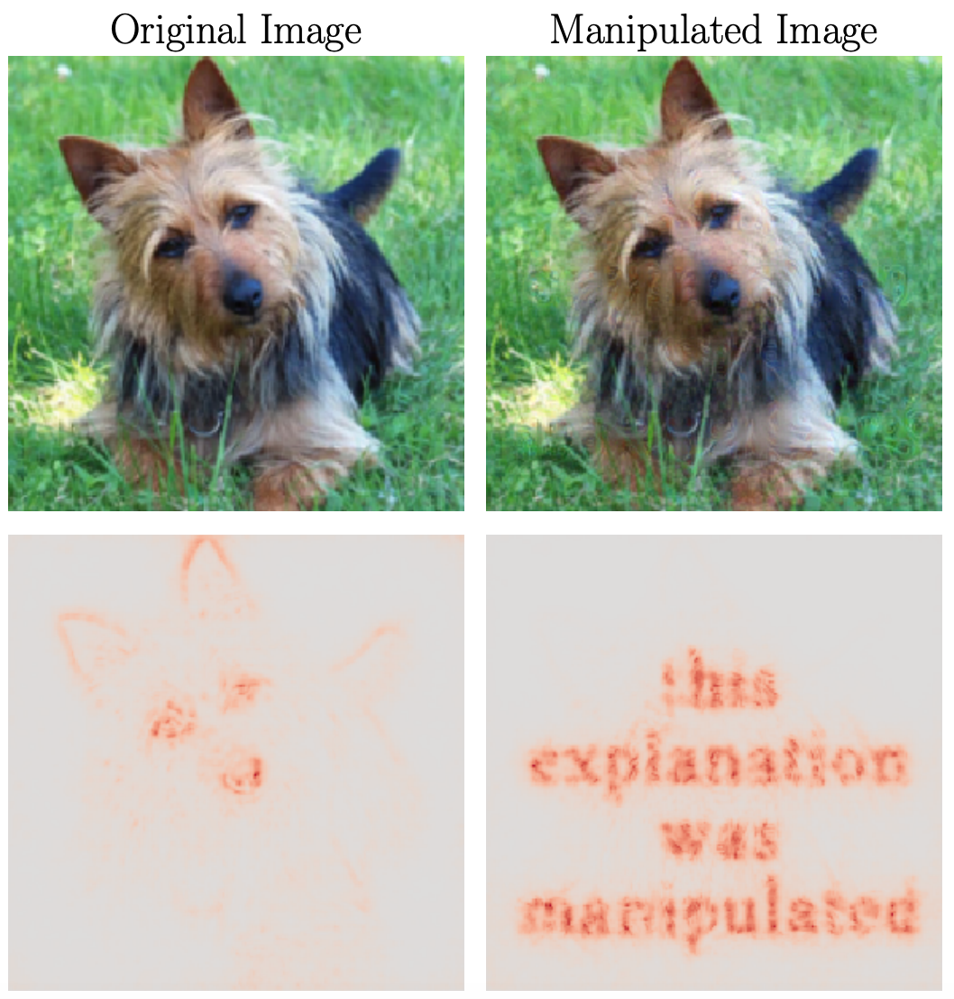

# adversarial_explanations

An implementation of the paper ['Explanations Can Be Fooled and Geometry is to Blame'](https://arxiv.org/abs/1906.07983).

Initial implementation will use the Integrated Gradients explanation method from the paper 'Axiomatic Attribution for Deep Networks.'

The meat of the explanation and attack implementations are in `integrated_gradients.py` and `adversarial_explanations.py`, respectively. `fashion_minst_example.ipynb` is a walkthrough of how to explain ML predictions and a demonstration of how to run the attack featuring the Fashion MNIST dataset.